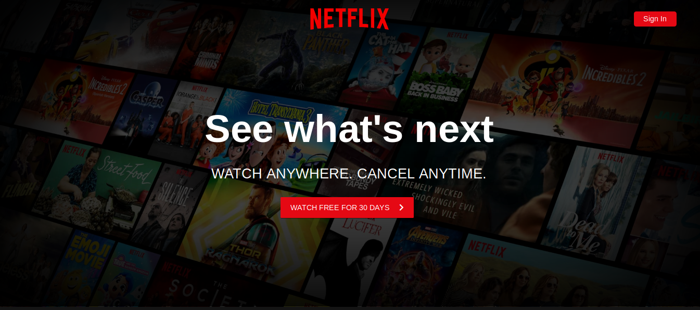
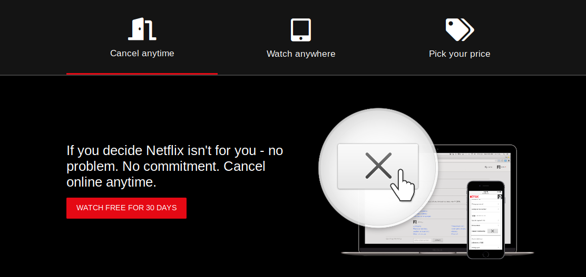
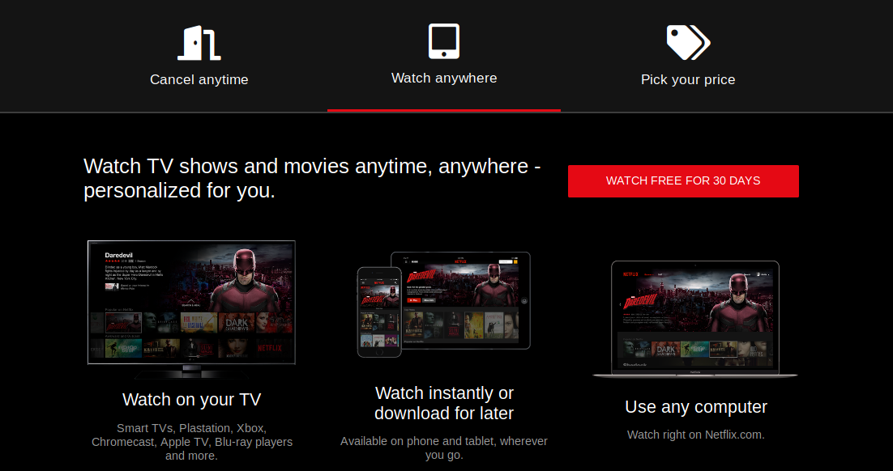
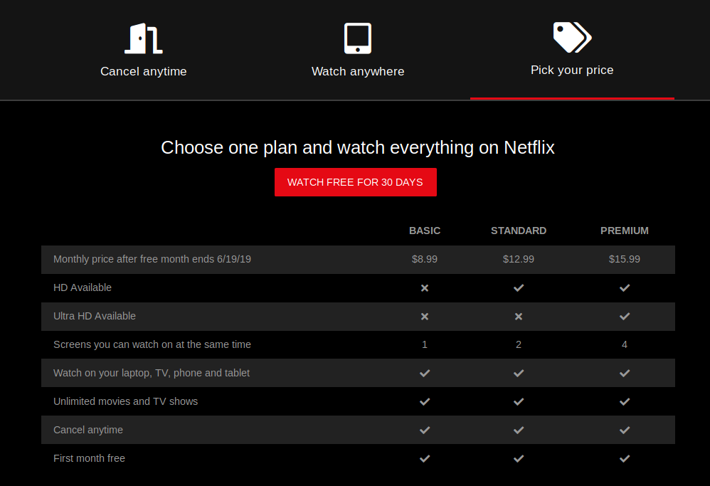

# A Netflix Landing Page Clone

A Netflix landing page clone using HTML, CSS and Javascript. This was done by following a Youtube [tutorial](https://www.youtube.com/watch?v=P7t13SGytRk) by Traversy Media. I have learnt some tips about styling in CSS by taking this tutorial.

What the tutorial code creates:

-   Main page of Netflix Landing Page

-   Content in each tab

